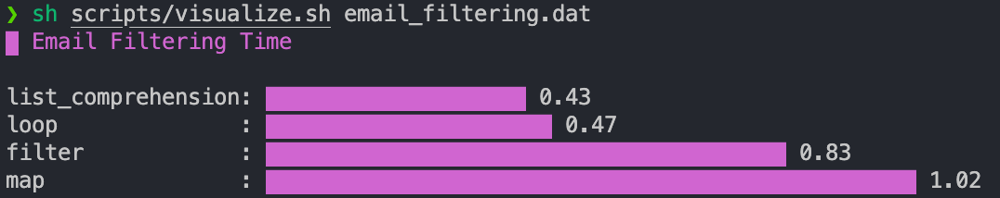
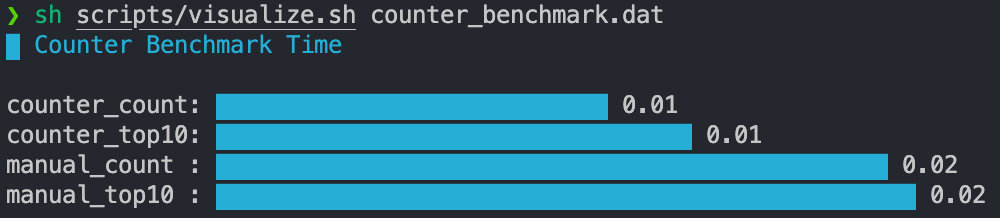
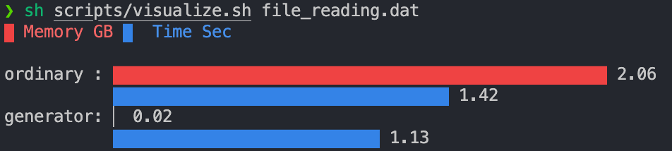
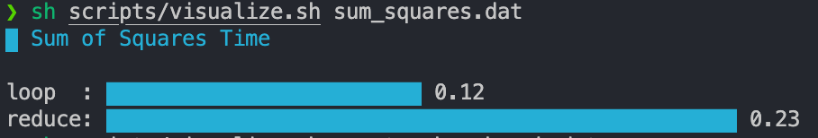

# Python Performance Benchmarks

A practical project demonstrating how different approaches in Python affect **execution speed** and **memory usage**.

The project is based on real measurements, not assumptions:

- `timeit` — execution time measurement
- `resource` — memory usage analysis
- `termgraph` — terminal visualization

---

## Before You Start

### 1. Install dependencies

```bash
pip install termgraph
```

---

### 2. Download dataset

The file reading benchmark uses the [MovieLens](https://grouplens.org/datasets/movielens/) dataset.

What you need to do:

1. Download the archive (`ml-25m`)
2. Extract it
3. Take the file:

```text
ratings.csv
```

> File size ~678 MB — it is not included in the repository

Place it in:

```text
data/ratings.csv
```

---

## What is covered in this project

### Email filtering

Comparison of approaches:

- loop
- list comprehension
- map
- filter

### Sum of squares

Comparison:

- loop
- reduce

### Counter vs manual implementation

Comparison:

- dict (manual counting)
- collections.Counter
- top-10 elements extraction

### File reading

Comparison:

- readlines (loading into memory)
- generator (lazy reading)

---

## Project structure

```text
python-performance-benchmarks/
├── benchmarks/        # benchmark logic
├── data/              # graph data (.dat)
├── results/           # benchmark results
├── scripts/           # helper scripts
├── utils/             # result saving
├── main.py            # entry point
├── requirements.txt
└── README.md
```

---

## Installation

```bash
git clone <repo>
cd python-performance-benchmarks

python3 -m venv .venv
source .venv/bin/activate

pip install -r requirements.txt
```

---

## Usage

### Run all benchmarks

```bash
sh scripts/run_all.sh
```

---

### Run individually

```bash
# email filtering
python3 main.py email 1000000

# sum of squares
python3 main.py squares 1000000 5

# counter
python3 main.py counter

# file reading
python3 main.py file ordinary data/ratings.csv
python3 main.py file generator data/ratings.csv
```

---

## Prepare data for graphs

```bash
python3 scripts/build_termgraph.py
```

---

## Visualization

```bash
sh scripts/visualize.sh email_filtering.dat
sh scripts/visualize.sh sum_squares.dat
sh scripts/visualize.sh counter_benchmark.dat
sh scripts/visualize.sh file_reading.dat
```

> `termgraph` must be installed

## Results and Analysis

Below are the benchmark results.

## Email Filtering



**Conclusion:**

- `list comprehension` is the fastest method  
- `loop` is slightly slower  
- `filter` and `map` are significantly slower  

Reason: list comprehensions are optimized at the C level and have lower overhead.

---

## Counter Benchmark



**Conclusion:**

- `collections.Counter` is faster than manual implementation  
- `most_common()` is more efficient than sorting  

Reason: built-in structures are optimized at the Python/C level.

---

## File Reading



**Conclusion:**

- generators use **orders of magnitude less memory**
- performance is comparable or sometimes faster

Reason: data is processed incrementally without loading everything into memory.

---

## Sum of Squares



**Conclusion:**

- plain `loop` is faster than `reduce`

Reason: `reduce` introduces additional function call overhead.

---

## Key Takeaways

- built-in Python tools are usually faster than manual implementations
- list comprehensions are faster than standard loops
- generators significantly reduce memory usage
- `reduce` may be slower due to overhead
- performance should be measured, not guessed

---

## Dependencies

```text
termgraph
```

---

## Notes

This project was created for educational purposes and is used as a pet project.
